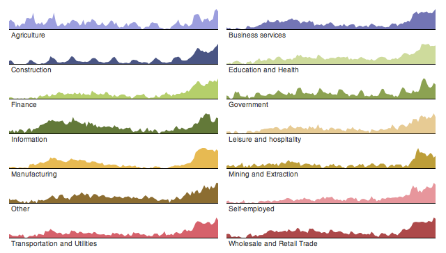

## 3 Formas de Visualizar un Dataset
Formas de visualizar la información en `datasets/argentina_1869-2020.tsv`

**Nota: Algunas provincias tienen valores es NULL que quiere decir que no hay datos para ciertos años. En esos casos se toma la decisión de tomarlos como si fuesen 0**

### Choropleth Map con slider
La idea de este mapa es que nos muestre la información de forma geográfica
y podemos observar la evolución de estos datos a través del tiempo con un slider.

### Small Multiples
Esta visualización puede ser muy útil para observar cómo evolucionan los datos a traves del tiempo. A la hora de visualizar, hay que ver si 24 small multiples
no serán demasiados y haran dificil la lectura en cuyo caso, una alternativa
sería separar los small multiples por región y tener botones que nos lleven
a las distintas regiones.

### Stacked Area Chart
Esta visualización nos puede dar a simple vista, qué provincias son las predominantes en cuanto al dato a estudiar a través del tiempo. Un análisis secundario que podemos agregar también es este mismo gráfico hacerlo por región. Es decir, agrupamos la información utilizando la función de agregación suma y observamos qué regiones son las predominantes a través del tiempo.
A la hora de pensar un gráfico así también se me ocurrió quizá hacer un *bar chart* pero la desventaja de este gráfico es que no encontré forma de mostrarlo a través del tiempo sin usar un slider que no me parecía tan útil como su alternativa que era el *stacked area chart*. La ventaja del *bar chart* es que podes colorear los *bins* por región, entonces si en algún momento necesitase graficar la información en un año específico, seguramente utilizaría este tipo de gráfico.

